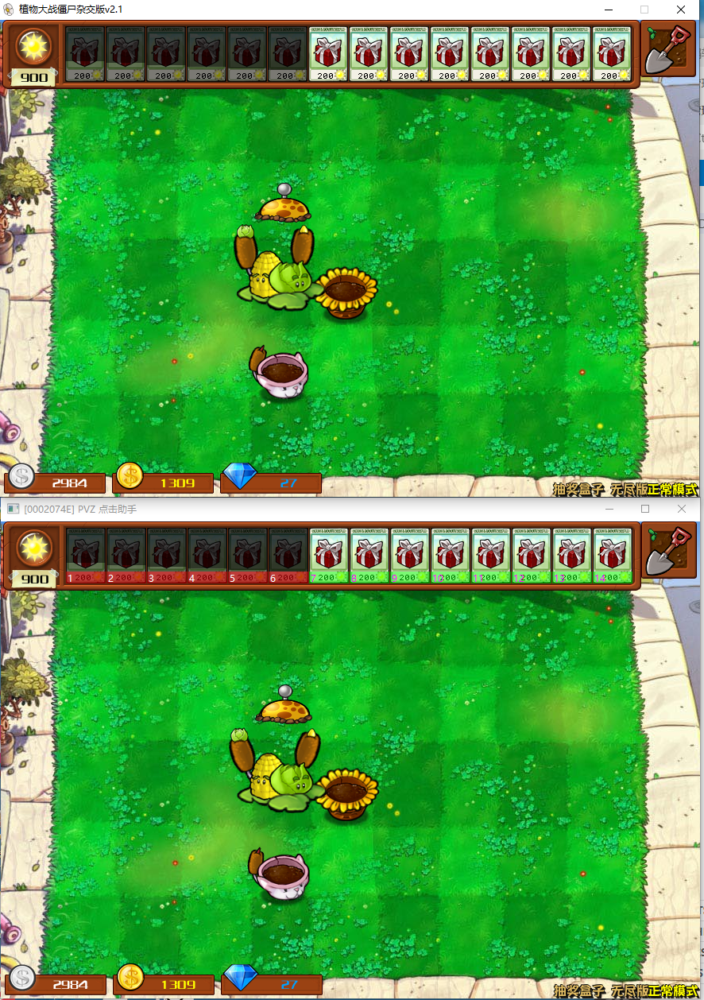

# PVZ 点击助手

## 说明

本工具旨在减轻杂交版 PVZ 盲盒模式对手指的损耗, 功能如下:

1. 使用<kbd>F1</kbd>~<kbd>F12</kbd>和<kbd>-</kbd>、<kbd>+</kbd>来种植第 1 到 14 株植物
2. 使用<kbd>Z</kbd>在当前鼠标位置种植从左往右首棵**可用**植物
3. 使用<kbd>C</kbd>铲除当前鼠标位置的植物

有如下令我自豪之特征:

1. 使用截图判断植物可用性, 不注入内存, 可无更新跨版本使用
2. 无压缩二进制文件只有 133KiB
3. 运行所消耗的 CPU 和 内存极小, CPU 用量 < 1%, 运行时内存 <= 9MiB
4. 使用古典 Windows API 技术开发, 理论上可在 XP 执行

TODO: 

1. 在全屏模式截图. 我还没找到可在 WindowsXP 到 Windows 11 共用的全屏截图方案, 期待大佬的指点. 
2. 在 Windows XP 和 Windows 7 测试程序可用性

## 下载

[Github](https://github.com/myuanz/pvz-click-helper/releases)

[百度网盘](https://pan.baidu.com/s/1RNppi0DVjdwQgPGc5NS8Xw?pwd=2333)

```
链接: https://pan.baidu.com/s/1RNppi0DVjdwQgPGc5NS8Xw?pwd=2333 提取码: 2333 复制这段内容后打开百度网盘手机App，操作更方便哦
```

## 截图

红色代表已识别的不可用卡片, 绿色代表识别的可用卡片




## 构建

```powershell
xmake
```

本项目自豪地使用 xmake 构建
